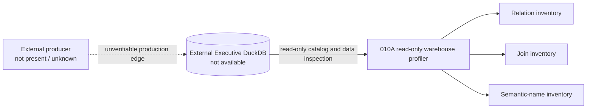
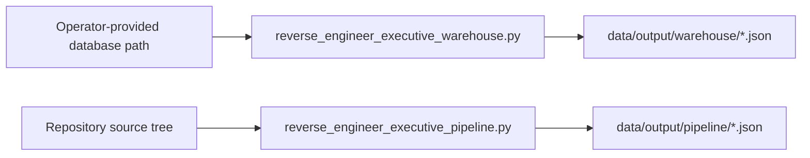
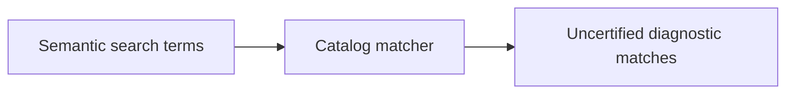

# 010B — Executive Processing DAG

## Evidence-backed pipeline DAG

The dotted edge is explicitly unknown. There are no evidence-backed raw-document, OCR, section,
fragment, extraction, refinement, semantic assembly, certification, or promotion nodes.

## Warehouse dependency graph

No relation-to-relation edge is established because the checked-in 010A relation inventory is
empty and this repository contains no Executive relation producer.

## Script dependency graph

The two scripts are independent diagnostic tools. Neither invokes the other or materializes a
warehouse relation.

## Table dependency graph

## Semantic generation graph

This graph describes discovery only. It does not generate governed executive knowledge.
