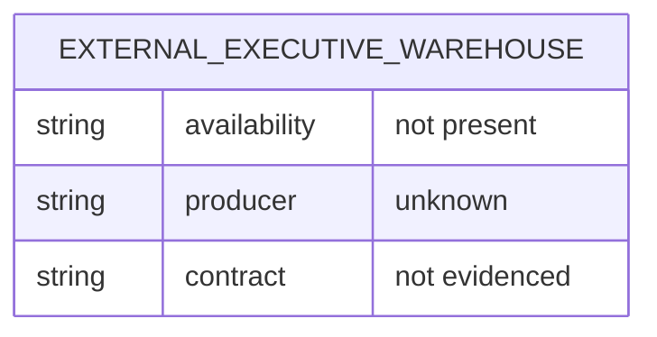

# 010B — Executive Processing ERD

## Evidence-state ERD

No entities, attributes, keys, cardinalities, or table relationships can be drawn from production
code in this repository. The prior 010A snapshots enumerate zero relations. Adding an Artifact,
Document, Page, Section, Knowledge, Refinement, or Semantic entity would therefore be an
unsupported assumption rather than reverse engineering.

## Contract classifications

| Classification | Evidence-backed relations |
|---|---|
| Current | None |
| Intermediate | None |
| Temporary | None |
| Experimental | None |
| Candidate | None |
| Review | None |
| Promotion | None |
| Certified | None |

This means “not identifiable from the available artifacts,” not “proven not to exist externally.”
