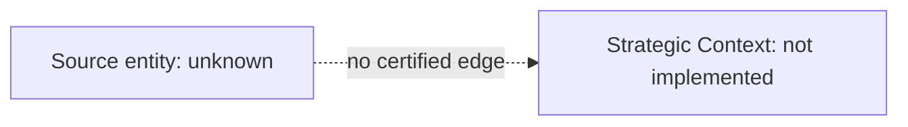

# 010A — Executive Lineage Graph

## Evidence State

The certified lineage graph is unknown because the Executive Warehouse was unavailable.

## Edge Admission Rules

An edge may be added only when its join has measured overlap and coverage, its cardinality is
known, and lineage intent is supported by a declared constraint or warehouse metadata. Similar
names and coincidentally overlapping values are insufficient. Version edges must additionally
identify the version key, ordering/effective field, and current-row rule.

## Unresolved Target

The source of `governed_finding`, its path to document identity and section lineage, and every
project, district, and program linkage remain unresolved.
