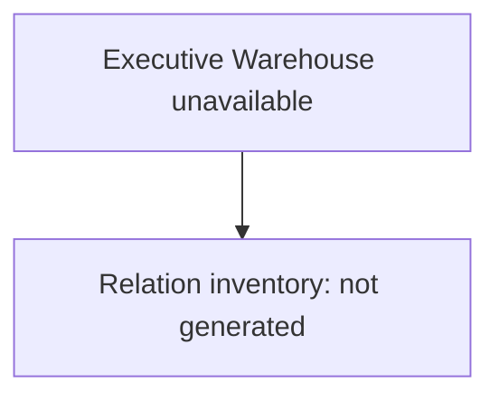

# 010A — Executive Warehouse ERD

## Evidence State

No Executive Warehouse database was available, so there are no evidence-backed entities or
cardinalities to diagram. This is the complete truthful ERD for the available evidence:

The profiler's measured join inventory distinguishes one-to-one, one-to-many, many-to-one, and
many-to-many candidates. Those results must be reviewed alongside declared warehouse constraints
before any edge is labelled certified lineage or version lineage.

## Prohibited Assumption

No edge between artifacts, documents, pages, sections, knowledge records, refined sections, or
semantic knowledge is implied by this document.
